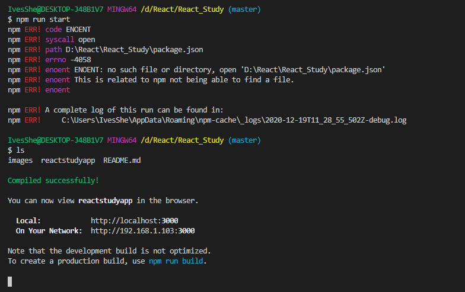

# React Study

# 安裝React

```bash
npm install -g create-react-app
```


# 創建項目

專案名好像只能小寫

```bash
create-react-app reactstudyapp
```


# 運行項目

```bash
num run start
```




# 實現頁面時刻的顯示


## 不同的寫法

```js
// 實現頁面時刻的顯示
function clock(){
  let time = new Date().toLocaleTimeString();
  let element = (
      <div>
        <h1>現在的時間是{time}</h1>
        <h2>這是副標題{time}</h2>
      </div>
    )
  let root = document.querySelector('#root');
  ReactDOM.render(element,root);
}

setInterval(clock,1000);
```


## 函數式組件開發 寫法

```js
// react函數式組件
function Clock(props){
    return(
        <div>
          <h1>現在的時間是{props.date.toLocaleTimeString()}</h1>
          <h2>這是函數式組件開發</h2>    
        </div>
    )
}

function run(){
  ReactDOM.render(
    <Clock date={new Date()} />,
    document.querySelector('#root')
  )
}

setInterval(run,1000);
```


